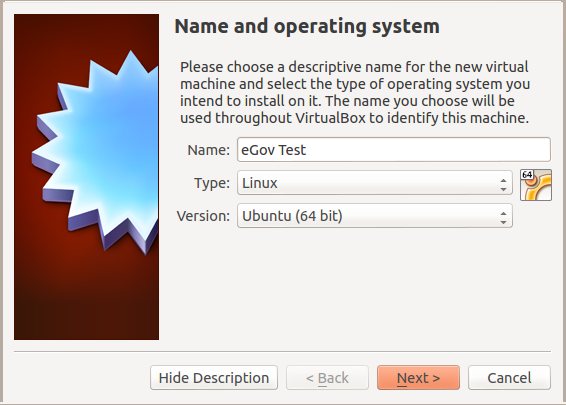
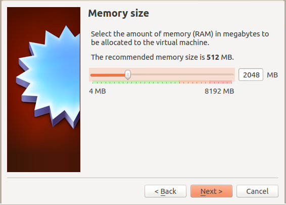
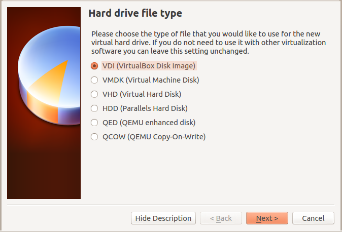
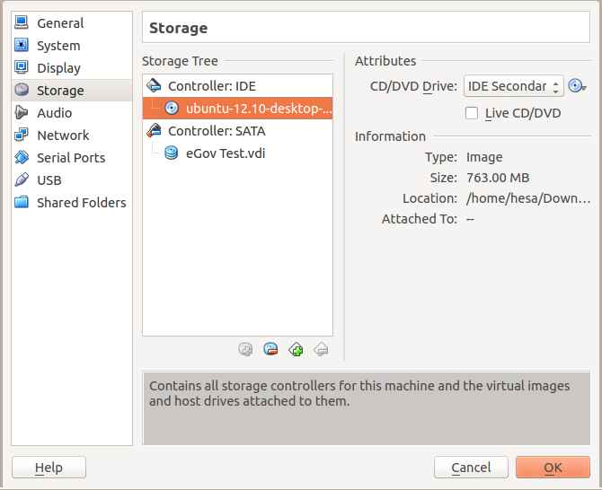
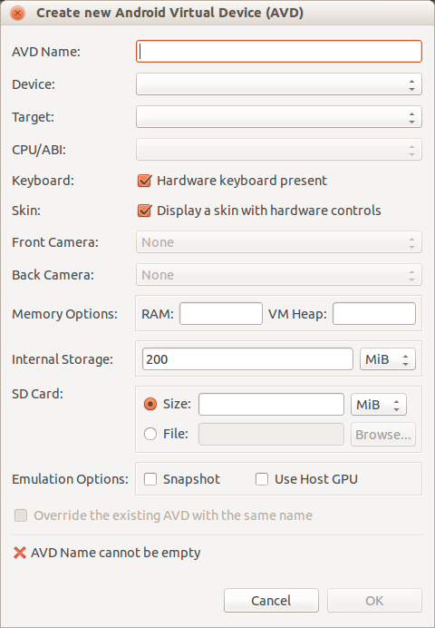

# eGov Testing Machine Manual

## About the project
The Autonomous Province of Bolzano currently offers important digital
services (for eg, online applications to start businesses, pay
property taxes and initiate e-Payments etc), the number is expected to
increase as eGoverment services continue to grow.

The FSCRS project intends to contribute to the creation and
improvement of eGovernment services through an innovative process that
verifies and tests functionality. The underlying idea of the project
is that the accessibility of digital public services is necessary to
increase the innovation potential of the region. .

The project takes its name from the Free Software Client Reference
System, a specific reference system (OS + defined set of software
applications) that during testing simulates a user accessing the
services.

## About the software

Testingmachine is used to test eGovernment services.  The eGovernment
services can vary from country to country but generally it grants
citizens access to important documents and information. In most EU
countries there are additional services like paying property tax that
can be done online. Most governments in Europe are leaning in this
direction in order to decrease administrative overhead.

Another challenge to overcome will be testing eGov services on mobile
platforms, more specifially automating tests under Android.  Good news
is this is possible using Selenium. The one major obstacle that we
face is getting around the smart card login. So far I am unaware of
getting this to work under Android unless you patch the kernel and
this is of course no an option. More documentation and research is
needed concerning this.


## The eGov Testing Machine

The expected result is the development of a systematic, auto
validation process, currently not available on the market, which
allows the testing of eGovernment services without the manual
intervention of an operator

The eGov Testing Machine can be thought of as a virtual group of
people, sitting at the computer and using the eGov services and
checking if they work properly, allowing the local Public
Administration to test eGov services on a daily basis that are being
offered to all citizens.

## Software Overview

The Testing Machine is currently made up by Virtual Machine Manager
(tm-vmm) and documentation on how to wite, execute and automate tests
of eGov sites in particular but also other softwares.

### Virtual Machine Manager (vmm)

tm-vmm is made up by bash scripts that let the user manage various
virtual machine software in a general way. See the tm-vmm manual for
more information.

### eGov Manuals

Writing tests of eGov sites is not hard but we believe that some help
will still be useful for most people. The manuals and guides provided
together with tm-vmm make it possible to test eGov sites automatically
and unattended.


# Features

## Virtual Machine Management

With Testing Machine you can:

* manage VirtualBox, Android, and QEMU virtual machines with a unified interface

* start/pause/stop virtual machines

* take screenshots of running virtual machines

* execute commands in running virtual machines
# Installation 

##  Software requirements

The bash, ssh and expect programs will be needed, but they are included in most
popular Linux distributions out-of-the-box.

You will also want at least one virtualization software (see list of supported
softwares below). The wmctrl package is optional, but with allow vmm to maximize
the window of your VirtualBox client systems.

In order to use vmm to run
[https://github.com/tis-innovation-park/tm-examples](the Testing Machine
examples), you will want a Java SDK and Ant. For Debian, run `apt-get install
default-jdk`. For Ubuntu, run `sudo apt-get install default-jdk ant`. For
Fedora, run `yum install java-1.7.0-openjdk ant`.

### Additional requirements for vmm developers

* pandoc - to generate documentation

* pdflatex - to generate documentation

## Supported Virtualization software

* Virtualbox (install it using `apt-get install linux-headers-$(uname -r|sed
  's,[^-]*-[^-]*-,,') virtualbox` on Debian-based systems (such as Debian and
  Ubuntu), or grab it from [https://www.virtualbox.org/wiki/Linux_Downloads](the
  VirtualBox Linux Downloads section))

* Android (install it by downloading
  [https://developer.android.com/sdk/index.html](the Android Development Toolkit
  Bundle), extract the ZIP archive, modify ~/.bashrc to include `export
  ANDROID_ADT_PATH=<Path to ADT bundle directory>`, and update your environment
  by executing `source ~/.bashrc`)

* qemu

We might support vmware in the future.

## Downloading Virtual Machine Manager

### Via git

* Download git code

  `git clone git://github.com/tis-innovation-park/vmm.git`

### Via a dist file (.tar.gz)

 Coming later

## Building and installing Virtual Machine Manager

* Go to the vmm directory

  `cd vmm`

* Configure the software (you can use --prefix=<installationdir> to
  specify a non-default installation directory)

  `./configure`

* Build the software

  `make`

* Install the software

  `sudo make install`

* Verify the installation (you might need to prepend the path to tm-vmm, if the
  installation directory is not in your $PATH)

  `tm-vmm --list-clients`
# Setup 

* Create the directory $HOME/.testingmachine

  `mkdir $HOME/.testingmachine`

* Create tm-vmm.conf in .testingmachine, typically with your favorite editor (emacs?)

  `emacs ~/.testingmachine/tm-vmm.conf`

In this file you can configure settings you want to use as default in
your clients. It is perfectly possible to override these settings in
your individual client configurations.

For a list of variables, see section Configuration syntax below.

## Creating a machine

To create a machine vmm relies on the virtualization software. So if
you want to manage a Virtualbox machine you (at least for now) create
it with Virtualbox. For information about how to do this, read the
chapter "Creating a Virtualbox machine" or "Creating an Android
Virtual Device".


## Preparing for creating a client

First of all you need to decide what machine you want to use with your
client. 

* Create a directory for all clients:

  `mkdir ~/.testingmachine/clients`

## Create a VirtualBox client

In the example below we will assume it is called Debian-6.0

### Create a client configuration file

You can create client configuration in two different ways:

* Manually
* Automatically

#### Create a configuration file manually

* Manually create a configuration file for the client (bound to a virtual machine):

      [CLIENT_NAME].conf

    * Set the variables as you find suitable for your project.

#### Create a configuration file automatically

* Use the command line option:

    `--create-client-conf`

Example usage of the option.

    `tm-vmm --create-client-conf  Debian-6.0`

It is assumed that Debian-6.0 is a VirtualBox image.

__Note:__ `--create-client-conf` will set the default value for the guest username to \`whoami\`. If your virtual machine uses some other username, you should modify the client configuration after running this command.

### Example of a client configuration:

`   VM_NAME=Debian6.0`

`   VM_TYPE="VirtualBox"`

`   VM_IP_ADDRESS=192.168.1.2`

`   VM_USER=$USER`

`   VM_SUPERUSER=root`

`   SSH_PORT=22`

`   SSH_SHUTDOWN_COMMAND="shutdown -h now"`

For more variables see section Configuration syntax below

* Copy your public ssh key to the machine's root account, e.g

  `ssh-copy-id -p 2256 `

## Create an Android client


In the example below we will assume it is called Nexus-10

### Create a client configuration file

You can create client configuration in two different ways:

* Manually
* Automatically

#### Create a configuration file manually

* Manually create a configuration file for the client (bound to a virtual machine):

      [CLIENT_NAME].conf

    * Set the variables as you find suitable for your project.

#### Create a configuration file automatically

* Use the command line option:

    `--create-client-conf`

Example usage of the option.

    `tm-vmm --create-client-conf  Nexus-10`

It is assumed that Debian-6.0 and Nexus-10 is the name either a VirtualBox or Android image.

__Note:__ `--create-client-conf` will set the default value for the guest username to \`whoami\`. If your virtual machine uses some other username, you should modify the client configuration after running this command.

### Example of a client configuration:


`VM_NAME="eGov-android-machine"`

`VM_TYPE="Android"`

`ANDROID_SYS=emulator64-arm`

For more variables see section Configuration syntax below

# Using Virtual Machine Manager

Regardless of the underlying virtual machine you manage the machine in
one way. We provide the most basic uses of tm-vmm here and encourage you
to read the complete list of command line options in the last section
of the manual.

## Starting

### Starting with guest operating system visible

`tm-vmm --start-client <CLIENT_NAME>`

Example:

`tm-vmm --start-client Ubuntu-10`

### Starting without showing guest operating system (headless)

`tm-vmm --start-client-headless <CLIENT_NAME>`

Example:

`tm-vmm --start-client-headless Ubuntu-10`

## Checking status

`tm-vmm --check-client-status <CLIENT_NAME>`

Example:

`tm-vmm --check-client-status Ubuntu-10`

## Stopping

`tm-vmm --stop-client <CLIENT_NAME>`

Example:

`tm-vmm --stop-client Ubuntu-10`

# Selenium

## About Selenium

*Selenium is a portable software testing framework for web
 applications. Selenium provides a record/playback tool for authoring
 tests without learning a test scripting language (Selenium IDE). It
 also provides a test domain-specific language (Selenese) [1] to write
 tests in a number of popular programming languages, including Java,
 C#, Groovy, Perl, PHP, Python and Ruby. The tests can then be run
 against most modern web browsers. Selenium deploys on Windows, Linux,
 and Macintosh platforms.*

This text is quoted from: http://en.wikipedia.org/wiki/Selenium_(software)

Selenium is run on the guest so some tweaks are needed to get things
working, but don't worry we've done almost everything for you.

## Writing Selenium tests

# Miscallaneous other softwares

## Sikuli

Installing Java is a prerequisite for running Sikuli. Install it with apt-get:

`sudo apt-get install openjdk-6-jdk`

The software can be installed on Ubuntu 12.04 LTS with the following command:

`sudo apt-get install sikuli`

## GNU Xnee

## wmctrl

The package “wmctrl” is used to resize windows.

`sudo apt-get install wmctrl`

# Launching tests using vmm

## Using crontab

## Using Jenkins

# Testing eGov sites


## Problems we've encountered 

### Logging in to a web site using a smart card

When setting up the Testingmachine in South Tyrol to test the *burger
card* the biggest obstacle we had to overcome was the login
process. Since this is done using a smart card and a pin we found no
way to do this using Selenium and so Sikuli was used.  Once logged in,
Selenium can be used to test the web services.

Getting Sikuli to perform an automatic login can be done in the following way:

## Sikuli

In order to use Sikuli a test case has to be made. This is done within
Sikuli to emulate the login process step by step.  A possible test
case could look like this:

```python
wait("KJ2.png",60)
click("1352889207953.png")
sleep(5)
wait("Pleaseentert.png",60)
click("Pleaseentert-1.png")
type("96414648")
sleep(1)
click("OK.png")
sleep(2)
wait("Thlssltehasr.png",60)
click("1352890307684.png")
sleep(2)
wait("Tl2fIlHlKJlI.png",60)
```

The .png files are created with Sikuli. When running Sikuli you can
take 'snapshots' of certain parts of the screen that are captured and
later used as a reference point where to perform certain functions
like emulating button presses or entering text. Sikuli then 'looks'
for parts of the screen that matches the 'snapshots' before it
performs actions. This works well with web pages since Sikuli can wait
until a page has loaded before executing a command.

**Note:** *We've also written some words on how to setup smart cards. See *


# Creating virtual machines

## Creating a VirtualBox machine with Ubuntu 12.10 

Basically you should follow the normal procedure, as described in the
VirtualBox manual, on how to create a new virtual machine. However we
provide a guide below to make this easier. You can choose to use our
settings or change some at your will.

**Note:** *If you’re on a Ubuntu system you might have to add your user to the vboxusers group. This can done like this: <code>sudo adduser \`whoami\` vboxusers</code>.*

### Start Virtualbox

In a terminal, type:
`virtualbox`

In the VM Virtualbox Manager window click "New"

### Name and operating system

* Name:	    eGov testing machine
* Type:	    Linux
* Version:  Ubuntu (64 bit)




### Memory size

* 2048 MB




### Hard drive

* Choose to create a virtual hard drive now


### Hard drive file type

* Choose VDI 



### Storage on physical hard drive

* Choose Dynamically allocated


### File location and size

* 8 GB should be enough


Your disk has now been created. Before starting it we need to do some additional settings.


### Network

#### Setup the network card

* Open up the VirtualBox Manager
* Choose your Virtual machine and click Settings
* Make sure Network Adapter 1 is enabled. 

The following settings should be applied to Adapter 1.

**Attached to**:  NAT (previously Bridged adaptor was advised)

* **Name**:       eth0
* **Advanced**:     
* **Adapter type**:		Intel PRO/1000 MT Desktop (...)
* **Promiscuous mode**: 	Deny
* **MAC Address**:		use the suggested
* **Cable connected**:		should be checked

*This gives your virtual machine an IP address on the same subnet as
 the host computer. See http://www.virtualbox.org/manual/ Chapter 6
 for additional information on bridged networking.*

##### Allowing SSH logins to your virtual machine

Open up the VirtualBox Manager

Choose your Virtual machine and click Settings

Choose Port forwarding

Add a new rule by clicking the + sign. Enter

* **Rule**: ssh
* **Protocol**: TCP
* **Host IP**:
* **Host Port**: 2256   (the value can basically be any free port on your host computer)
* **Guest IP**:
* **Guest Port**: 22


#### USB

Make sure USB is enabled if you plan to use a smart card reader or another USB device.

You might encounter an error saying "Failed to access the USB subsystem". In that case, you probably need to add yourself to the vboxusers group. On Ubuntu, this can done like this: <code>sudo adduser \`whoami\` vboxusers</code>.

To use a smart card reader in your virtual machine you have to do the following:

* Attach the smart card reader to your computer
* Add Filter from Device (Alt + Ins) and choose the device that is attached to the physical machine. 
* The same procedure applies to other peripherals, like a USB storage device.

See http://www.virtualbox.org/manual/ Chapter 3 for additional information

### Installing Ubuntu

Download the preferred Ubuntu iso image from ubuntu.com

Click Settings and choose storage. 

Add the downloaded iso image to the virtual machine as a CD-ROM by clicking the Empty icon (image missing) under Controller: IDE and then click on the disc icon right of the text CD/DVD Drive: . 


Choose a virtual CD/DVD disk file ... and point out the downloaded iso image (e.g. ubuntu-12.10-desktop-amd64.iso).



Click Start

Follow the installation instructions to install Ubuntu in your new virtual machine.

#### Upgrading your installation

To upgrade your system you need to:

* Click on the Software updater icon to your left (it may take up to a few minutes before the icon appears)
* Click install now
* Enter password

_Note:_ If the Software Updater icon is not available in the sidebar, you can press the "Win/Super" key and type "Software Updater" to start it.

Ubuntu might require a restart when the update process is finished.

#### Installing necessary tools in your virtual machine

The following tools need to be installed on your virtual machine

* openssh-server

Install them by typing the following command in a terminal window,
assuming you’re logged in as your first user (created during the
Ubuntu installation):

sudo apt-get install openssh-server


#### Setting up users on the virtual machine

Log in to your virtual machine as the user you created during installation.


##### Setting up a new user

vmm puts no restrictions or requirements on the name of the user in
your virtual machine. The user name “vmm” is given here as an
example and will be used in all manual text below.

Log in as the user you created during the Ubuntu installation.

Open up a user management tool by pressing the dasher (logo missing) and type user accounts. 

* Press the unlock symbol and type in the password of the first user you created. 

* Press the + symbol. You will now see a new window, called Create new account, in which you should fill in:

**Account Type**:	      Standard
**Full name**:		      Virtual Machine Manager
**Username**		      vmm

* Click on Enable password and type in a password.

##### Setting up the root account

* Permit root to login via the ssh server.
* Launch a terminal window 
* Open up the ssh server configuration file

`sudo gedit /etc/ssh/sshd_config` 

* Make sure that PermitRootLogin is set to yes
* Restart the ssh server

`sudo /etc/init.d/ssh restart ` 

* Add the ssh key of your host user to vmm account

  `ssh-copy-id "-p 2256 vmm@localhost"`

* Test your user acoount

 `ssh -p 2256 vmm@localhost whoami`

* Add the ssh key of your host user to the root account

  `ssh -p 2256 vmm@localhost -t "sudo mkdir /root/.ssh && sudo cp /home/vmm/.ssh/authorized_keys /root/.ssh/"`

* Disable password (for user vmm) when using sudo 

  `ssh -p 2257 root@localhost "echo \"vmm ALL=(ALL) NOPASSWD:ALL\" >> /etc/sudoers"`

* Test your root acoount

 `ssh -p 2256 root@localhost whoami`

We assume here that you're using port 2256 for ssh and that your user
is called vmm. Change it accordingly if not. 
**Note**: Make sure that your port (-p 2256) and host arguments (vmm@localhost) are enclosed between the same parenthesises.


## Creating a Android Virtual Device 

Basically you should follow the normal procedure, as described on the
Android Developer pages manual: http://developer.android.com/tools/devices/index.html.

We do, however, provide a guide below to make this easier. You can
choose to use our settings or change some at your will. In this guide
we will setup a Nexus 7 device.

### Start Android Virtual Device Manager

First, you need to make sure that the ANDROID and ANDROID_ADT_PATH environment
variables are set, so that vmm can find the Android application utilities.

In a terminal, type:

`android avd`

In the Android Virtual Device Manager window click "New"


### Create new Android Virtual Device (AVD)

* Name:	    eGov-android-machine
* Device:   Nexus 7
* Target:   Android 4.2

You can keep the default values for all other settings.




# Example use:

/opt/bin/tm-vmm --check-client-status Ubuntu-12.10

/opt/bin/tm-vmm --check-client-status Ubuntu-12.10

/opt/bin/tm-vmm --check-client-ssh    Ubuntu-12.10

/opt/bin/tm-vmm --client-exec         Ubuntu-12.10 "pkcs15-tool -L"


# Project Communication

## Reporting bugs

Try to be as precise as possible when reporting bugs. The more
information we get the bigger chance we have of fixing the problem.

Use the mailing list below to report bugs.

## Getting involved

*How to join:* clone the repo, try it out -- join the mailing list :)

For more information read the developer guidelines.

## Mailing list

We have one mailing list for the project:
`  community@testingmachine.eu  `

Join this list here:
`https://lists.testingmachine.eu/cgi-bin/mailman/listinfo/community`

If you send emails to this list as a non subscriber chances are it
will get lost. 

If you want to report a bug:
* use a github account and add an issue
* subscribe to the mailing and send the report to the list

## Blog

https://testingmachine.eu/blog

## Home page

https://testingmachine.eu/

Source code is located here:
`https://github.com/tis-innovation-park/vmm`

## Social media

### Twitter

https://twitter.com/FSCRS


# Testing Machine vmm configuration

## Configuration file syntax

The syntax for setting a variable is the same as in bash scrips (no coincidence!). Basically you write:

`VARIABLE=VALUE`

### Variables 

`LOG_FILE_DIR=/tmp/tm-vmm/log` - sets the log file base directory to /tmp/vmm/log. This means that all logs can be found here.

`VM_STARTUP_TIMEOUT=10` - the time to wait for a virtual machine to start up before considering it to be 'dead'.

`VM_STOP_TIMEOUT=20` - the time to wait for a virtual machine to start up before taking more drastic actions to take down the machine. Ultimately vmm will take down a machine with a `kill`.

`SSH=ssh` - the SSH program to use

`SSH_TEST_OPTIONS=" -o connectTimeout=3"` - the options to pass to the SSH program (see SSH variable above) when testing of the machine is up (or not).

`VM_NAME="Debian6.0"` - the name of the machine to use in this client. It is important that your Virtualization software can find this machine.

`VM_TYPE="VirtualBox"` - what type of Virtulization software this machine belongs to. Currently you can use: VirtualBox and qemu

`VM_IP_ADDRESS=192.168.x.x` - the IP address of the virtual machine 

`VM_USER=$USER` - the user you want to use when accessing the virtual machine

`VM_SUPERUSER=root` - the name of the super user/administrator account, typically used to reboot the machine 

`SSH_PORT=22` - the port where the SSH server is running on the client

`SSH_SHUTDOWN_COMMAND="shutdown -h now"` - vmm will do its very best to shut down a machine as gracefully as possible. One way to do this is to try to shut it down using SSH. The command in this variable will be used to do that.

`ANDROID_ADT_PATH=/opt/adt-bundle-linux-x86_64-20130219` - Path to Android SDK installation. vmm will use this to find the commands adb and android. 

`ANDROID=~/example/bin/android` - Specify the android command. This overrides the android command as found using the environment variable ANDROID_ADT_PATH.

`ADB=~/example/bin/adb` - Specify the adb command. This overrides the android command as found using the environment variable ANDROID_ADT_PATH.


# tm-vmm Command line options


## Client options

`--list-clients` - Lists all configured clients

`--start-client CLIENT_NAME` - Starts the client called CLIENT_NAME

`--start-client-headless CLIENT_NAME` - Starts the client called CLIENT_NAME as headless (no screen)

`--stop-clients CLIENT_NAME` - Stops the client called CLIENT_NAME

`--list-running-clients` - Lists all clients currently running

`--check-client-ssh CLIENT_NAME` - Checks if ssh is up on the client called CLIENT_NAME

`--check-client-status CLIENT_NAME` - Checks if the client called CLIENT_NAME is up and running

`--client-exec CLIENT_NAME COMMAND` - Execeutes the COMMAND on the client called CLIENT_NAME

`--client-exec-as-root CLIENT_NAME COMMAND` - Execeutes the COMMAND on the client called CLIENT_NAME as root

`--client-x11 CLIENT_NAME` - Checks if X11 is up and running on the client called CLIENT_NAME

`--client-screenshot CLIENT_NAME` - Takes a screenshot on the client called CLIENT_NAME (not 100% ready)

`--print-client CLIENT_NAME` - Prints the configuration for the client called CLIENT_NAME

`--wait-for-ssh CLIENT_NAME TIMEOUT<optional>` - Waits until ssh is up and running on the client called CLIENT_NAME (Default TIMEOUT value is 120 if it is not set by the user)

`--wait-for-client CLIENT_NAME TIMEOUT<optional>` - (Needs updating) (Default TIMEOUT value is 120 if it is not set by the user)

`--open-ssh CLIENT_NAME TIMEOUT<optional>` - Opens an interactive shell (using ssh) on the client called CLIENT_NAME (Default TIMEOUT value is 120 if it is not set by the user)

`--check-client-online CLIENT_NAME` - Checks if the client called CLIENT_NAME can ping the outside world

`--pause-client CLIENT_NAME` - Pauses the running client

`--resume-client CLIENT_NAME` - Resumes the paused client

`--client-exec-fail CLIENT_NAME COMMAND` - Executes the COMMAND on the client called CLIENT_NAME and turns it off upon failure

`--create-client-conf CLIENT_NAME` - Creates the configuration for the client called CLIENT_NAME automatically

`--snapshot-client CLIENT_NAME` - Takes a screen shot on the client called CLIENT_NAME (not implemented for VirtualBox)

`--client-copy-file SRC DST` - Copies a file from a client to a host or from a host to a client; a host resource could be "~/myhostfile", and a client resource could be "[CLIENT_NAME]:~/myclientfile"

`--is-client-up CLIENT_NAME` - Checks whether the client called CLIENT_NAME is running

`--unlock-screen CLIENT_NAME` - Unlocks the screen of the virtual machine (Android only for now)

`--install-app CLIENT_NAME PACKAGE` - Installs application PACKAGE on the client called CLIENT_NAME (APK, DEB or RPM); APK files are not yet transferred to the client

`--uninstall-app CLIENT_NAME APP_NAME` - Uninstalls application APP_NAME on the client called CLIENT_NAME (APK, DEB or RPM)

`--print-client-settings CLIENT_NAME` - Prints the path to the client's configuration

`--get-client-os CLIENT_NAME` - Displays the operating system of the client called CLIENT_NAME

`--for-clients-run SCRIPT [CLIENT_NAMES]` - For each client, starts it, run the script, and stop it. CLIENT_NAMES is a semi-colon-seprated list of client names. If CLIENT_NAMES is left out, all clients will be used. The following variables will be set in the script: CLIENT_NAME, CLIENT_TYPE ("vbox" or "android"), CLIENT_STARTED (0 means yes), CLIENT_UP (0 means yes), and CLIENT_SSH_UP (0 means yes).


## Machine options

`  --list-machines` - Lists all machines known to vmm

`  --start-machine MACHINE_NAME` - Starts machine named MACHINE

` --start-machine-headless MACHINE_NAME` - Starts machine called VM_NAME as headless (no screen)

` --stop-machine MACHINE_NAME`  - Stops machine named MACHINE

` --check-machine-status MACHINE_NAME` - Checks status on the machine called MACHINE_NAME

`--list-running-machines` - Lists all machines currently running

`--pause-machine MACHINE_NAME` - Pauses the running virtual machine

`--resume-machine MACHINE_NAME` - Resumes the paused virtual machine


## Other

`--version` - Checks the current version of the tm-vmm

`--import-appliance APPLIANCE` - Imports an OVA file into VirtualBox (OVF, Open Virtualization Format, is a cross-platform standard for packaging ready-made virtual machines that can be imported to virtualizers, while OVA is the name of a tar archive file with the OVF directory inside)
